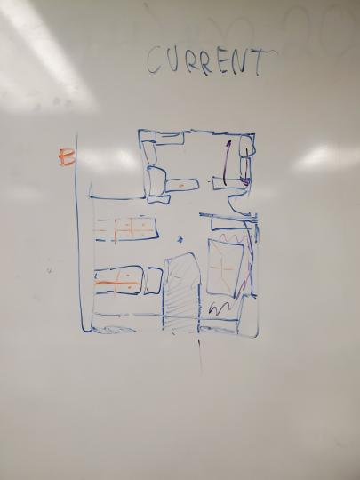
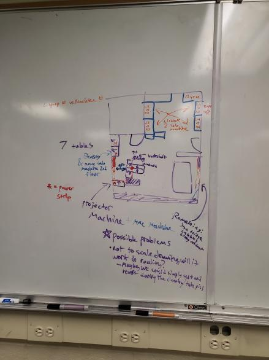

# Room Layout Discussion

The purpose of this document is to record people's opinions, ideas, and sentiments with regard to changing the layout of COSI (Spring 2020).

## Current Situation

8 Tables in back half of cosi (1 laptop space)
1 Mini table for printer

10 Tables (6 laptop spaces) and Big Table in front half of cosi
1 Mini table for cable stuffs

## What's Currently Bad

Whiteboard access is limited (desk next to the projector machine prevents the space behind it from being used and the shelving&magazine units are cluttering the left side of the board).

Back half of the room is cluttered and does not offer more than one laptop space.

Laptop space is not very acessible when most lab members use laptop machines and want more laptop spaces.

Having a new layout could be refreshing and some space optimizations could make some aspects of COSI nicer in the day-to-day.

## What's Being Considered

The after-meeting slot that was spent coming up with a new layout for the room took a lot of time and deliberation and is the accumulation of several current lab members thoughts/opinions/ideas. The over-arching goal of this new layout is to move things with a purpose and to make the community happier. Note: the following drawings of the room layouts were not made with exact precision and as such are not exactly to scale.

Here is a photo of the current layout:

Here is a photo of the new layout (note that there is a general layout scheme and the smaller pieces of COSI, like bookshelves and non-desk tables, can be rearranged without much difficulty):

Before proceeding with an explanation of the new layout, it should be brought up the concern we had in the beginning. For example, some concerns might include the amount of space between the two machines and the server room door, as well as the amount of leg room and mobility between the left wall and the back of the two desks facing the hall windows. Measurements were taken and it was verified that there would be a decent amount of space for these areas (of course, testing this layout would be the ultimate way to verify this for certain). Given these measurements, the drawing is actually not too far off and the visual positions of these items in COSI fit this scheme.

We start off the crux of this layout with the two desks containing lab machines which are facing Snell (next to server room). The purposes for their location includes being the base for this layout plan as well as being a convenient place to have lab machines (wiring is easier and there's less cluttering). [Optional: we move one of these lab machines to the second floor and put Beasty in one of these desk spaces].

Next, there were many lab members who were concerned about privacy (desiring no big open spaces for your back to be open to, as well as avoiding passerby from having an angle to view screens). This was a significant reason for which previously suggested layouts were not in favor by a majority of lab members. In this layout, we can fit 7 desks in the left side of the room (possibly 8 when we test it). The position of the 4 laptop spaces are arranged in such a way where the backs aren't facing big spaces and people in the hallway don't have a direct line of sight to laptop screens. Also, in our current layout, the desks are commonly cluttered and the theoretical 6 laptop spaces are more like 4 in practice (the current layout makes it easy for clutter to accumulate, thus taking up laptop spaces), this has been observed. So the practical difference in usable laptop space is not much different and the new layout discourages clutter. Another nicety is that an extension cord is easily positioned in the center of these four desks without getting in the way of anything (route it around project machine). Also, the amount of space behind the desks in front of the wall is actually large enough to the point that both bookshelves can be located directly behind them and still offer a good amount of navigation space. Also, another nice benefit is that the bookshelves aren't big enough to significantly prevent outside light from coming in, but just big enough to prevent the sun from causing annoying glare on the screens during the day. The power/wire cabinet can be moved to the back of the T-array of desks and the table that is currently located next to the cubbies can be moved next to the projector machine. Note, the Mac can be moved to the projector machine desk which will allow it to be projected from as well. Now that Beasty and the Mac have been relocated, the desk that currently supports these two machines can be moved or removed entirely. Now, only the cubbies, fsu fridge + 3D printer, and the filing cabinet are taking up space near the big table. Now the metal shelving unit and magazine rack can easily be moved to these new open spaces by the wall facing the annex and the whiteboard is now fully usable besides the space behind the projector machine. Even with the relocation of these pieces, the big table will have much more room for people to move chairs around, and the cubbies in which their access is being inhibited by the original layout's bookshelf is now completely open and accessible (and it's much easier to get to the fridge/navigate around table).

Finally, the back of the room (where the VR towers are) would only take on a small transformation. Since laptop space is in hot demand right now, the lab machines that are necessary back here would be Cthulu (Ryzen) and the two goth machines. So out of the 8 desk spaces back there, 3 would be occupied by these machines, and all the old computers/clutter that hasn't been touched in a very long time would be cleaned out. This will open up an additional 5 laptop spaces (and the machines can be arranged however desired, note, having one machine facing the hallways and one machine facing the server room recieved alot of positive sentiment).

If you made it this far, then it should be clear that the placement of each individual thing in COSI was taken into consideration (but still open to feedback as well).

## TLDR

Here are the pros and cons of the new layout configuration (feedback from lab members meeting in this space is welcome). 

## Pros

`+` Convenient lab machine locations, making wiring easy and uncluttered

`+` New layout avoids the current layout's problem of chairs being left in inconvenient places and easily bumping the back of your chair into another chair

`+` Supports privacy concerns

`+` Discourages the generation of clutter (thus, prevents rendering potential work spaces unusable)

`+` Wiring in general is very simple

`+` More moving space around the big table

`+` Full access to cubbies

`+` Whiteboard more cleared of clutter and the full length (besides behind projector machine) is fully accessible

`+` 7 laptop spaces (current) -> 9 laptop spaces (new)

## Cons

`-` There are a couple less tables to sit at in the front of COSI (might be mitigated by utilizing the positions of the thinner desks)

## Documentation

As witnessed in the past, whenever the subject of large changes to the room layout is brought up, it can be very prone to disagreement and controversy among the community. In the spirit of spring cleaning (not only of the physical space in COSI, but also of COSI's services and the attempt of creating an updated docs/), this is a good opportunity to document information for future generations of cosinauts. A panorama of the current layout and a panorama of the new layout we test will be taken and notes on the positives and negatives will be documented alongside these images so that if a future group of cosinauts would like to consider changing the layout, they can consider previous layouts that were tested and see what people thought of them.
